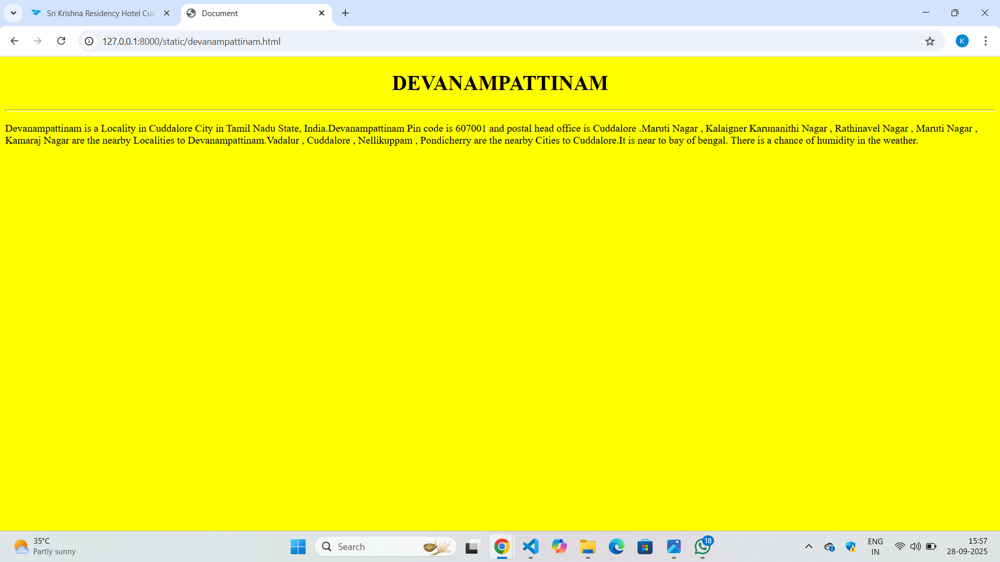
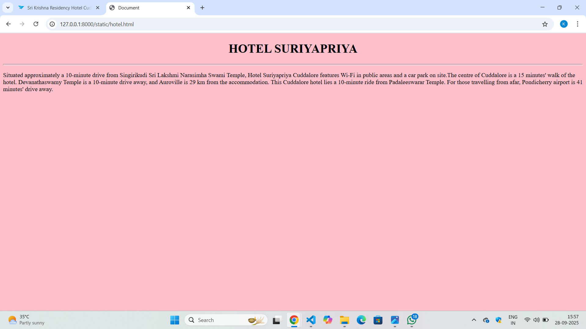
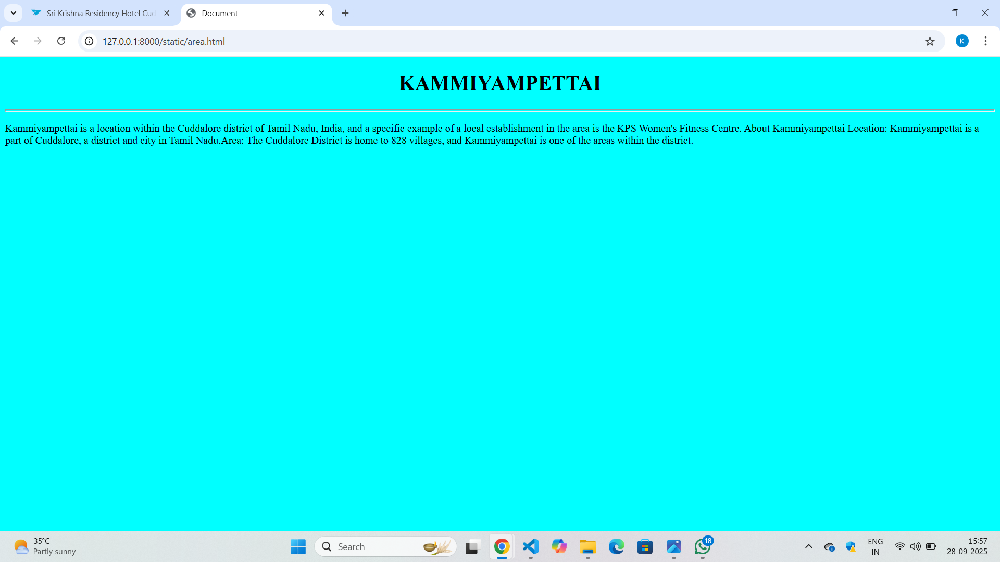
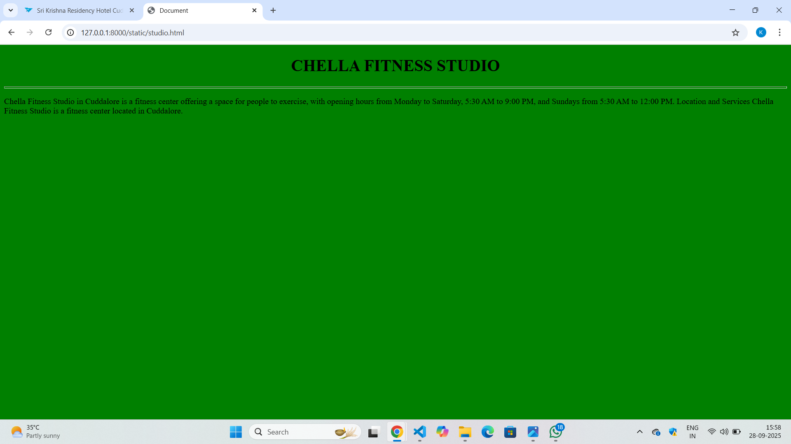
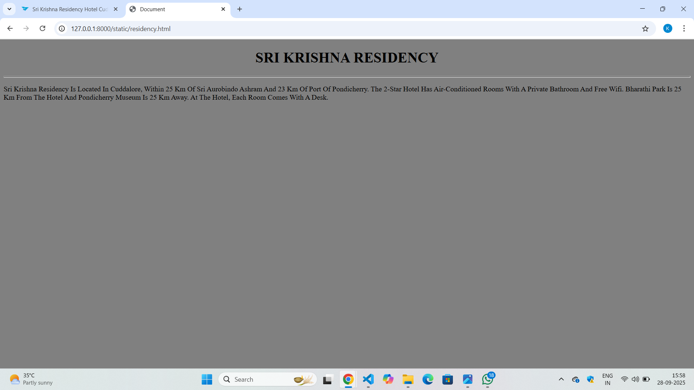

# Ex04 Places Around Me
## Date:28.09.2025 

## AIM
To develop a website to display details about the places around my house.

## DESIGN STEPS

### STEP 1
Create a Django admin interface.

### STEP 2
Download your city map from Google.

### STEP 3
Using ```<map>``` tag name the map.

### STEP 4
Create clickable regions in the image using ```<area>``` tag.

### STEP 5
Write HTML programs for all the regions identified.

### STEP 6
Execute the programs and publish them.

## CODE
```
map.html

<html>
    <head>
        <title>Sample Page</title>
        <link rel="stylesheet" href="style.css">
    </head>
    <body>


<map name="image-map">
    <area target="" alt="Devanampattinam" title="Devanampattinam" href="devanampattinam.html" coords="1461,409,1648,475" shape="rect">
    <area target="" alt="Hotel Suryapriya" title="Hotel Suryapriya" href="hotel.html" coords="1233,210,65" shape="circle">
    <area target="" alt="Kammiyampettai" title="Kammiyampettai" href="area.html" coords="779,173,848,152,912,164,929,205,887,232,825,225,789,196,882,193,786,185,809,171" shape="poly">
    <area target="" alt="Chella fitness studio" title="Chella fitness studio" href="studio.html" coords="659,509,814,561" shape="rect">
    <area target="" alt="Sri Krishna residency" title="Sri Krishna residency" href="residency.html" coords="1056,453,1264,499" shape="rect">
</map>
    </body>
</html>

devanampattinam.html

<!DOCTYPE html>
<html lang="en">
<head>
    <meta charset="UTF-8">
    <meta name="viewport" content="width=, initial-scale=1.0">
    <title>Document</title>
</head>
<body bgcolor="yellow">
    <h1 align="center">DEVANAMPATTINAM</h1>
    <hr size="5">
    <p>
        Devanampattinam is a Locality in Cuddalore City in Tamil Nadu State, India.Devanampattinam Pin code is 607001 and postal head office is Cuddalore .Maruti Nagar , Kalaigner Karunanithi Nagar , Rathinavel Nagar , Maruti Nagar , Kamaraj Nagar are the nearby Localities to Devanampattinam.Vadalur , Cuddalore , Nellikuppam , Pondicherry are the nearby Cities to Cuddalore.It is near to bay of bengal. There is a chance of humidity in the weather.
    </p>   
</body>
</html>

hotel.html

<!DOCTYPE html>
<html lang="en">
<head>
    <meta charset="UTF-8">
    <meta name="viewport" content="width=device-width, initial-scale=1.0">
    <title>Document</title>
</head>
<body bgcolor="pink">
    <h1 align="center">HOTEL SURIYAPRIYA</h1>
    <hr size="5">
    <p>
        Situated approximately a 10-minute drive from Singirikudi Sri Lakshmi Narasimha Swami Temple, Hotel Suriyapriya Cuddalore features Wi-Fi in public areas and a car park on site.The centre of Cuddalore is a 15 minutes' walk of the hotel. Devanathaswamy Temple is a 10-minute drive away, and Auroville is 29 km from the accommodation. This Cuddalore hotel lies a 10-minute ride from Padaleeswarar Temple. For those travelling from afar, Pondicherry airport is 41 minutes' drive away.
    </p>
    
</body>
</html>

area.html

<!DOCTYPE html>
<html lang="en">
<head>
    <meta charset="UTF-8">
    <meta name="viewport" content="width=device-width, initial-scale=1.0">
    <title>Document</title>
</head>
<body bgcolor="cyan">
    <h1 align="center">KAMMIYAMPETTAI</h1>
    <hr size="5">
    <p>
        Kammiyampettai is a location within the Cuddalore district of Tamil Nadu, India, and a specific example of a local establishment in the area is the KPS Women's Fitness Centre. About Kammiyampettai Location: Kammiyampettai is a part of Cuddalore, a district and city in Tamil Nadu.Area: The Cuddalore District is home to 828 villages, and Kammiyampettai is one of the areas within the district.
    </p>
    
</body>
</html>

studio.html

<!DOCTYPE html>
<html lang="en">
<head>
    <meta charset="UTF-8">
    <meta name="viewport" content="width=device-width, initial-scale=1.0">
    <title>Document</title>
</head>
<body bgcolor="green">
    <h1 align="center">CHELLA FITNESS STUDIO</h1>
    <hr size="5">
    <p>
        Chella Fitness Studio in Cuddalore is a fitness center offering a space for people to exercise, with opening hours from Monday to Saturday, 5:30 AM to 9:00 PM, and Sundays from 5:30 AM to 12:00 PM. Location and Services Chella Fitness Studio is a fitness center located in Cuddalore.
    </p>
    
</body>
</html>

residency.html

<!DOCTYPE html>
<html lang="en">
<head>
    <meta charset="UTF-8">
    <meta name="viewport" content="width=, initial-scale=1.0">
    <title>Document</title>
</head>
<body bgcolor="grey">
    <h1 align="center">SRI KRISHNA RESIDENCY</h1>
    <hr size="5">
    <p>
        Sri Krishna Residency Is Located In Cuddalore, Within 25 Km Of Sri Aurobindo Ashram And 23 Km Of Port Of Pondicherry. The 2-Star Hotel Has Air-Conditioned Rooms With A Private Bathroom And Free Wifi. Bharathi Park Is 25 Km From The Hotel And Pondicherry Museum Is 25 Km Away. At The Hotel, Each Room Comes With A Desk. 
    </p>
    
</body>
</html>

```


## OUTPUT







## RESULT
The program for implementing image maps using HTML is executed successfully.
